# АРХИТЕКТУРА И ЛОГИКА РАБОТЫ БОТА
## MAX Productivity Bot - Детальная архитектура с направлениями масштабирования

---

## 1. ОБЩАЯ АРХИТЕКТУРА СИСТЕМЫ

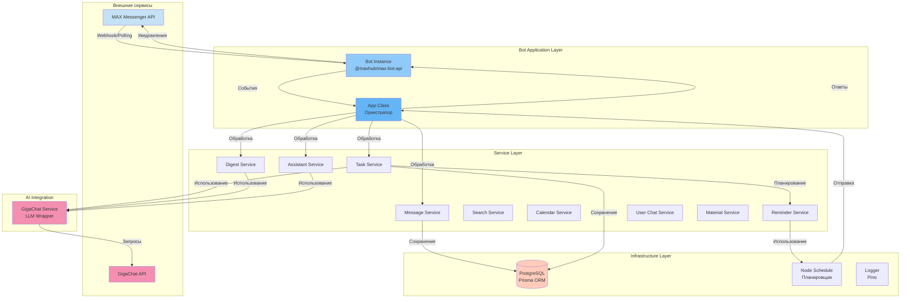

---

## 2. ЛОГИКА ИНИЦИАЛИЗАЦИИ И ЗАПУСКА

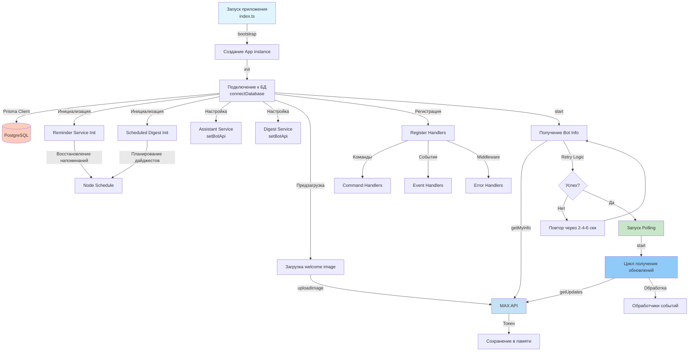

---

## 3. ОБРАБОТКА ВХОДЯЩИХ СООБЩЕНИЙ

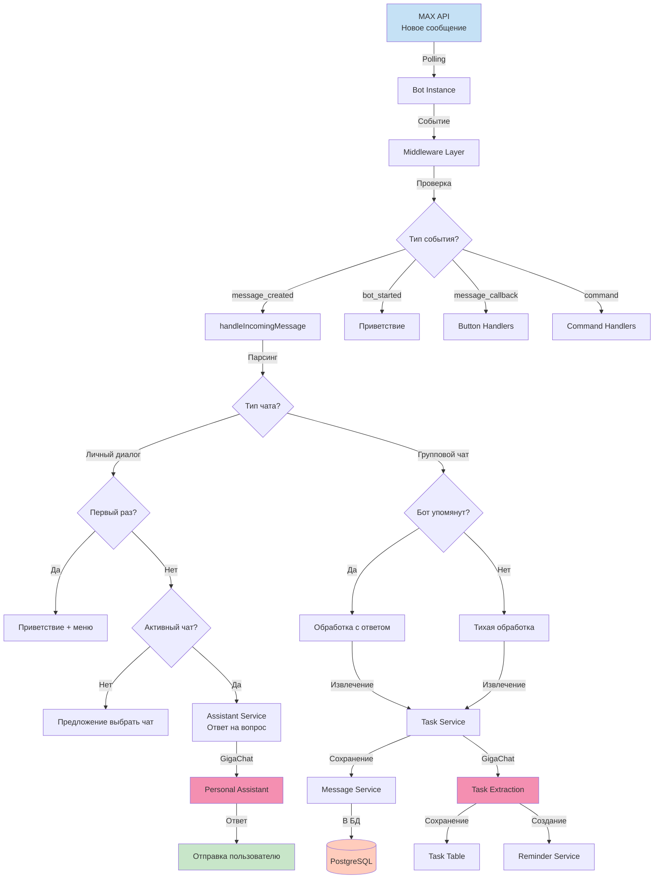

---

## 4. ОБРАБОТКА КОМАНД

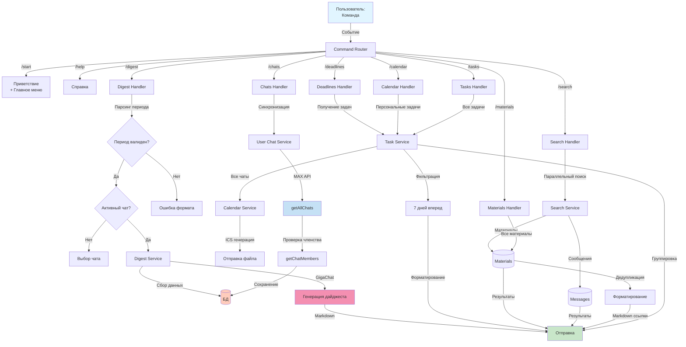

---

## 5. ИЗВЛЕЧЕНИЕ И ОБРАБОТКА ЗАДАЧ

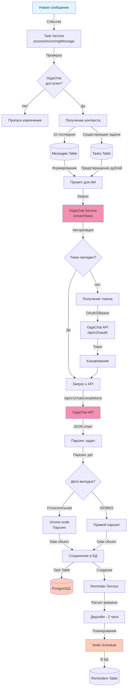

---

## 6. ГЕНЕРАЦИЯ ДАЙДЖЕСТОВ

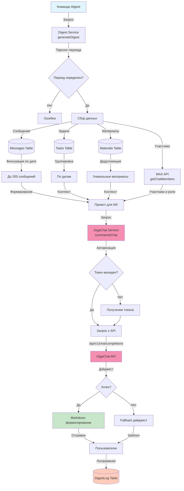

---

## 7. ПЕРСОНАЛЬНЫЙ АССИСТЕНТ

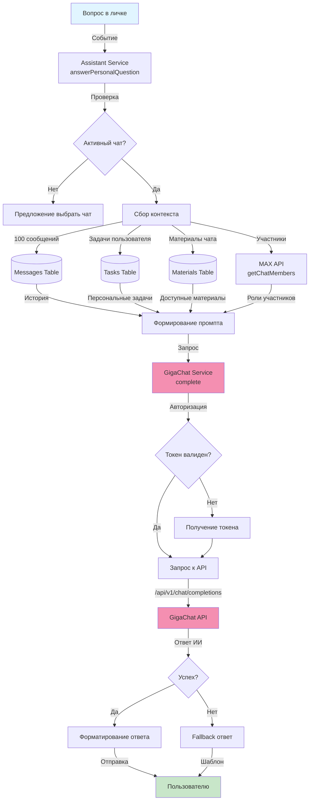

---

## 8. СИСТЕМА НАПОМИНАНИЙ

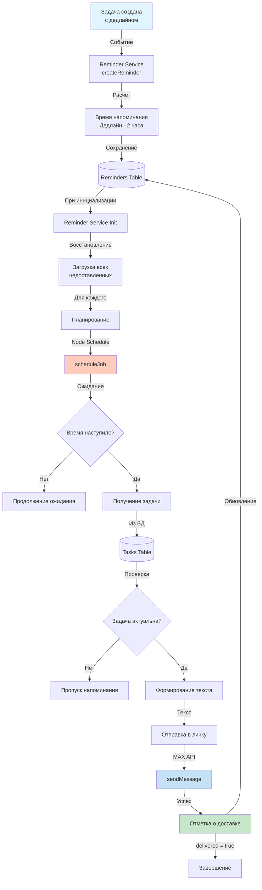

---

## 9. УПРАВЛЕНИЕ ЧАТАМИ

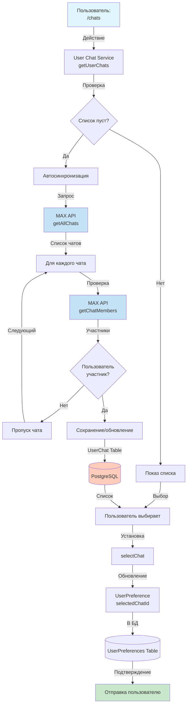

---

## 10. ОБРАБОТКА МАТЕРИАЛОВ

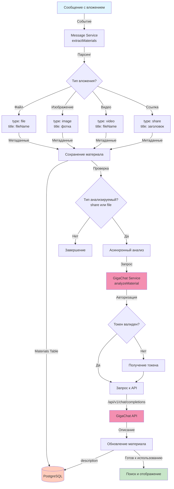

---

## 11. ПОТОК ДАННЫХ В СИСТЕМЕ

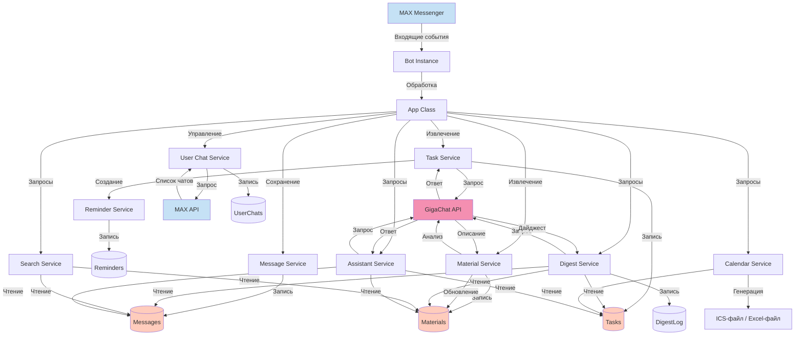

---

## 12. НАПРАВЛЕНИЯ ДЛЯ МАСШТАБИРОВАНИЯ

```mermaid
graph TD
    A[Текущая архитектура] -->|Горизонтальное масштабирование| B[Множественные инстансы бота]
    A -->|Вертикальное масштабирование| C[Оптимизация БД]
    A -->|Кэширование| D[Redis Cache Layer]
    A -->|Очереди| E[Message Queue]
    A -->|Микросервисы| F[Разделение сервисов]
    
    B -->|Load Balancer| G[Распределение нагрузки]
    B -->|Shared State| H[Redis для состояния]
    
    C -->|Индексы| I[Оптимизация запросов]
    C -->|Партиционирование| J[Разделение таблиц]
    C -->|Read Replicas| K[Репликация БД]
    
    D -->|Кэш токенов| L[GigaChat токены]
    D -->|Кэш результатов| M[Дайджесты]
    D -->|Кэш чатов| N[Списки чатов]
    
    E -->|Асинхронная обработка| O[Task Queue]
    E -->|Обработка материалов| P[Material Queue]
    E -->|Напоминания| Q[Reminder Queue]
    
    F -->|API Gateway| R[Единая точка входа]
    F -->|Task Service| S[Отдельный сервис]
    F -->|Digest Service| T[Отдельный сервис]
    F -->|Assistant Service| U[Отдельный сервис]
    
    style A fill:#e1f5ff
    style B fill:#c8e6c9
    style D fill:#fff9c4
    style E fill:#ffccbc
    style F fill:#f48fb1
```

---

## 13. КОМПОНЕНТЫ И ИХ ОТВЕТСТВЕННОСТЬ

### 13.1. Application Layer
- **App Class**: Главный оркестратор, регистрация обработчиков, управление жизненным циклом
- **Bot Instance**: Обертка над MAX Bot API, обработка событий, отправка сообщений

### 13.2. Service Layer
- **Message Service**: Сохранение и извлечение сообщений из БД
- **Task Service**: Извлечение задач из сообщений через GigaChat, управление задачами
- **Digest Service**: Генерация дайджестов обсуждений
- **Assistant Service**: Ответы на персональные вопросы пользователей
- **Search Service**: Поиск по материалам и сообщениям
- **Calendar Service**: Экспорт задач в календарь (ICS и Excel)
- **Reminder Service**: Планирование и отправка напоминаний
- **User Chat Service**: Управление списком чатов пользователя
- **Material Service**: Извлечение и анализ материалов

### 13.3. Infrastructure Layer
- **PostgreSQL + Prisma**: Хранение данных, миграции, ORM
- **Node Schedule**: Планирование задач (напоминания, дайджесты)
- **Logger (Pino)**: Структурированное логирование

### 13.4. AI Integration
- **GigaChat Service**: Обертка над GigaChat API, управление токенами, запросы к LLM

---

## 14. ОБРАБОТКА ОШИБОК И УСТОЙЧИВОСТЬ

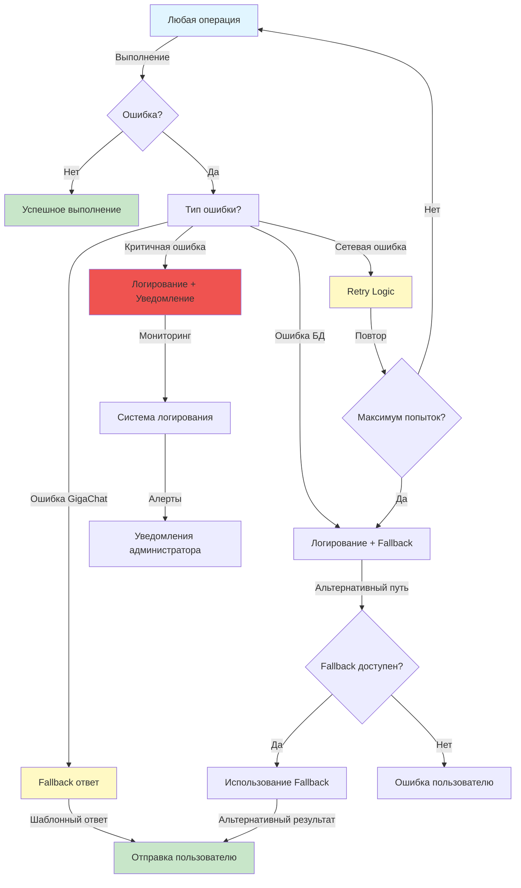

---

## 15. БЕЗОПАСНОСТЬ И КОНФИДЕНЦИАЛЬНОСТЬ

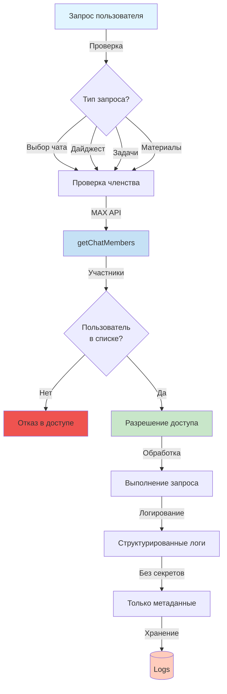

---

## 16. ПРОИЗВОДИТЕЛЬНОСТЬ И ОПТИМИЗАЦИЯ

### 16.1. Текущие оптимизации
-  Предзагрузка welcome image при старте
-  Кэширование GigaChat токенов
-  Индексы в БД для частых запросов
-  Дедупликация материалов
-  Ограничение количества сообщений для анализа (200)
-  Асинхронная обработка материалов через ИИ

### 16.2. Потенциальные улучшения
-  Redis для кэширования результатов
-  Message Queue для асинхронной обработки
-  Connection Pooling для БД
-  Batch processing для массовых операций
-  CDN для статических ресурсов

---

## ЗАКЛЮЧЕНИЕ

Архитектура бота построена на принципах:
-  **Модульность**: Разделение на независимые сервисы
-  **Масштабируемость**: Возможность горизонтального и вертикального масштабирования
-  **Надежность**: Обработка ошибок, retry-логика, fallback-механизмы
-  **Безопасность**: Проверка доступа, конфиденциальность данных
-  **Производительность**: Оптимизация запросов, кэширование, асинхронная обработка

Система готова к использованию в production и может быть расширена для больших нагрузок.

