# ПОЛЬЗОВАТЕЛЬСКИЕ СЦЕНАРИИ И АРХИТЕКТУРА БОТА
## MAX Productivity Bot - Схемы взаимодействия

---

## 1. ОБЩАЯ АРХИТЕКТУРА СИСТЕМЫ

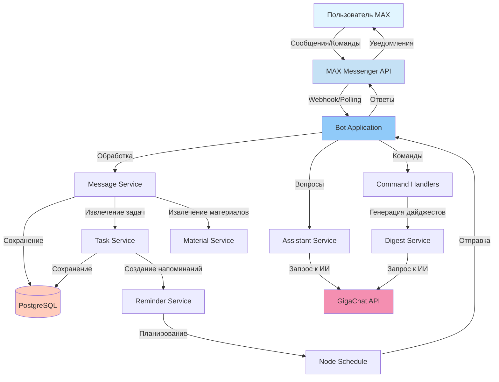

---

## 2. СЦЕНАРИЙ: ПЕРВОЕ ВЗАИМОДЕЙСТВИЕ С БОТОМ

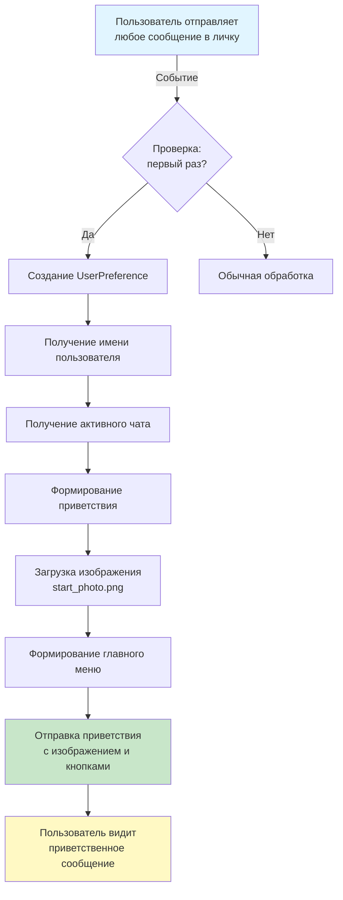

---

## 3. СЦЕНАРИЙ: РАБОТА С ДАЙДЖЕСТАМИ

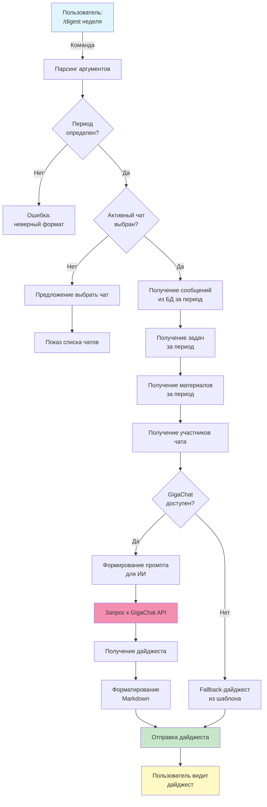

---

## 4. СЦЕНАРИЙ: АВТОМАТИЧЕСКОЕ ИЗВЛЕЧЕНИЕ ЗАДАЧ

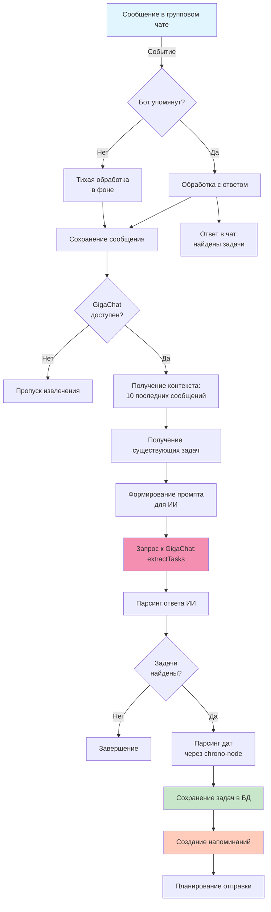

---

## 5. СЦЕНАРИЙ: ПЕРСОНАЛЬНЫЙ АССИСТЕНТ

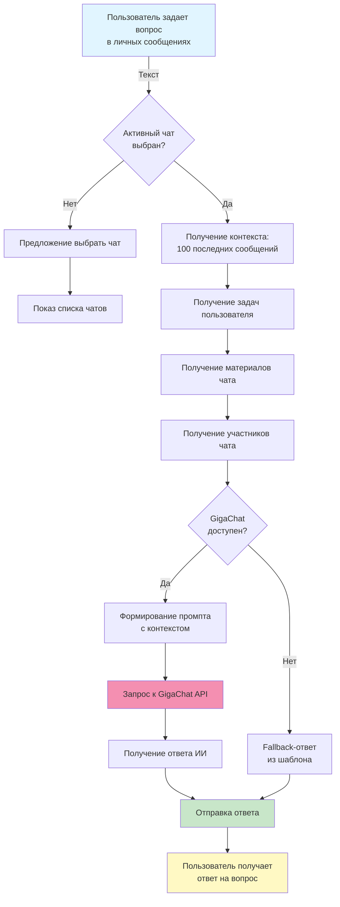

---

## 6. СЦЕНАРИЙ: УПРАВЛЕНИЕ ЧАТАМИ

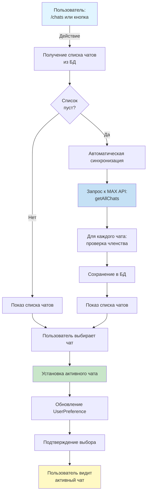

---

## 7. СЦЕНАРИЙ: ПОИСК МАТЕРИАЛОВ И СООБЩЕНИЙ

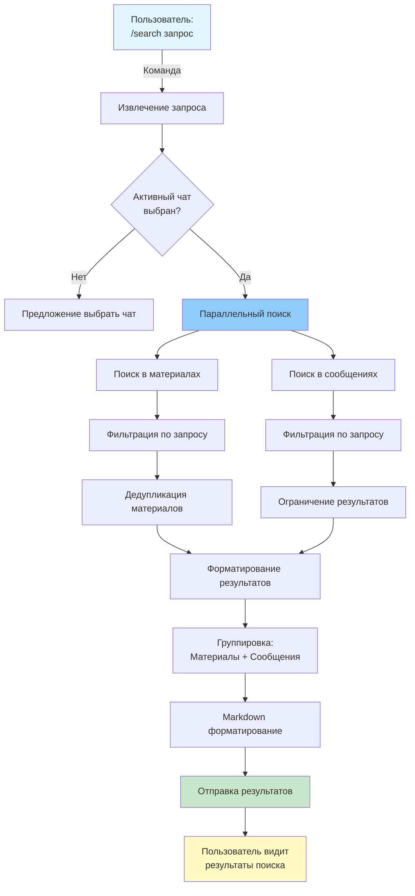

---

## 8. СЦЕНАРИЙ: ЭКСПОРТ КАЛЕНДАРЯ

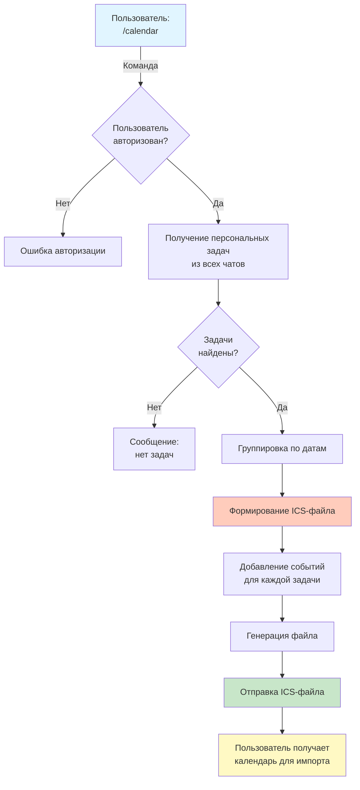

---

## 9. СЦЕНАРИЙ: АВТОМАТИЧЕСКИЕ НАПОМИНАНИЯ

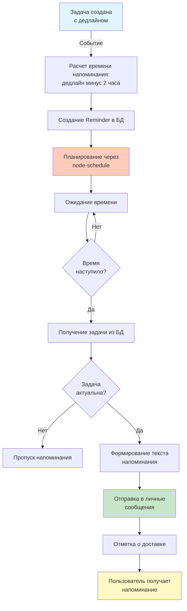

---

## 10. СЦЕНАРИЙ: ОБРАБОТКА МАТЕРИАЛОВ

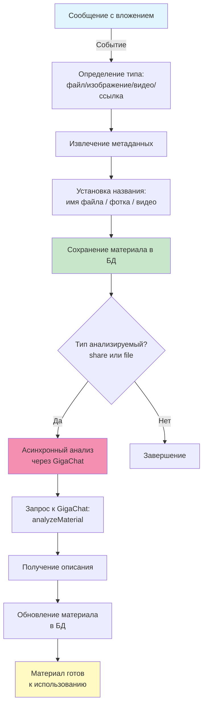

---

## 11. СЦЕНАРИЙ: ПРОСМОТР ДЕДЛАЙНОВ

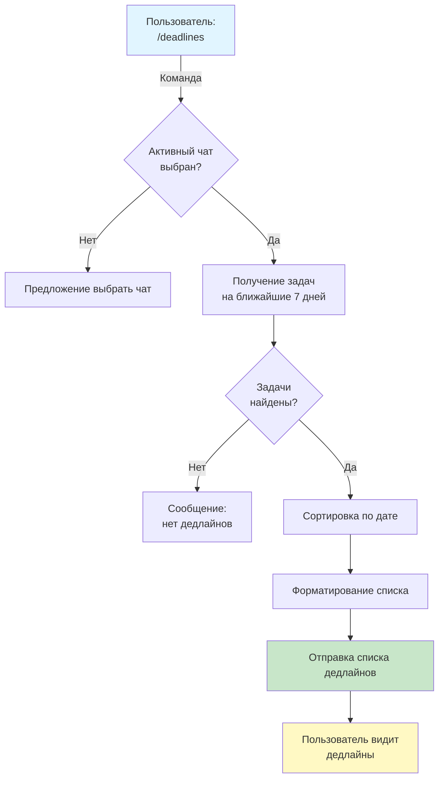

---

## 12. СЦЕНАРИЙ: ПРОСМОТР МАТЕРИАЛОВ

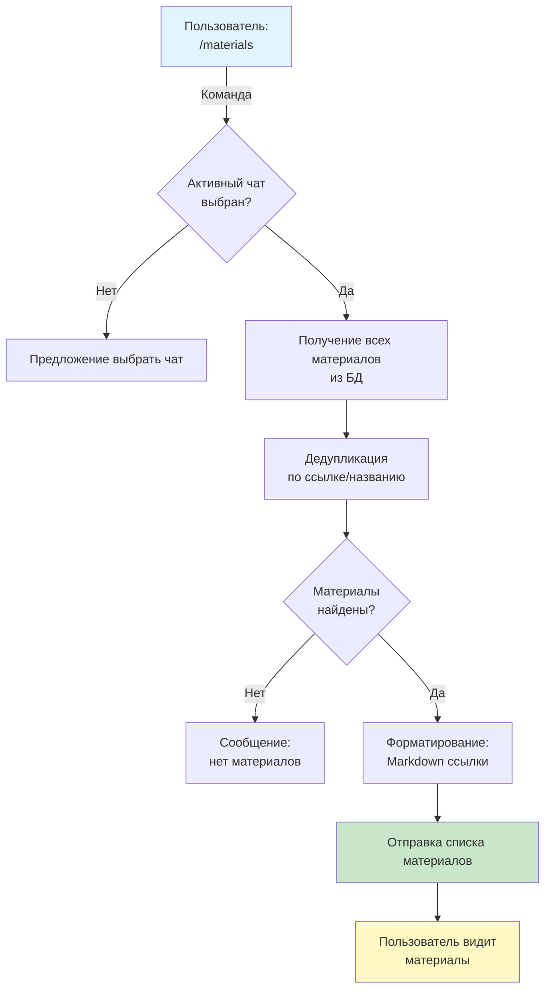

---

## 13. ЗАВИСИМОСТИ МЕЖДУ СЕРВИСАМИ

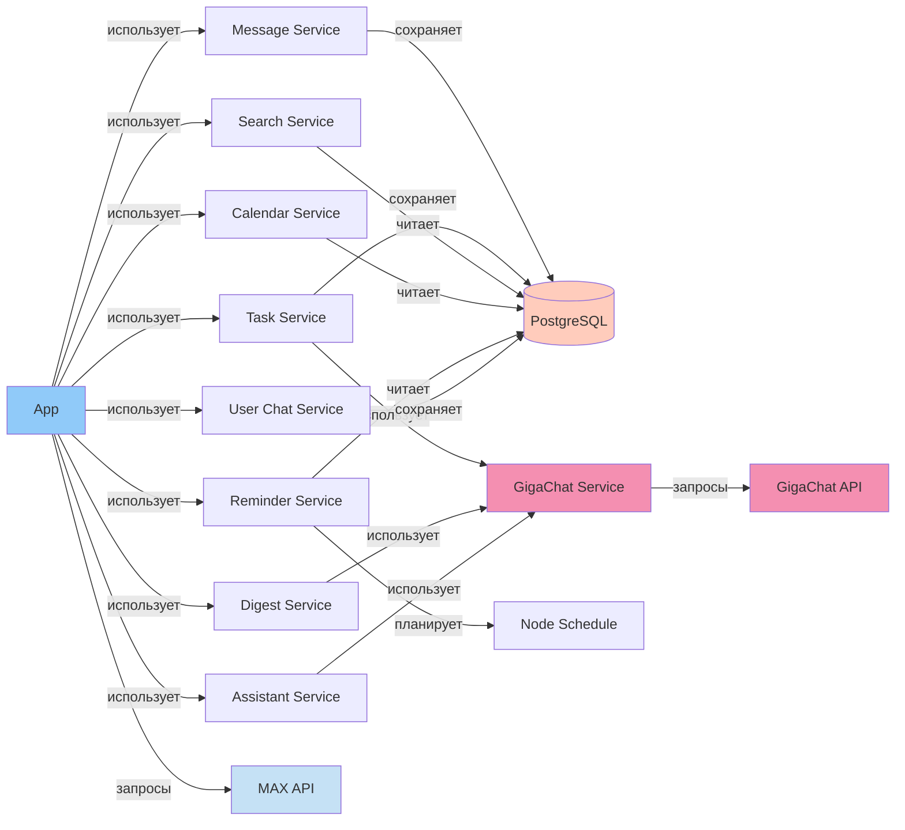

---

## 14. ПОТОК ДАННЫХ: ОТ СООБЩЕНИЯ ДО ХРАНЕНИЯ

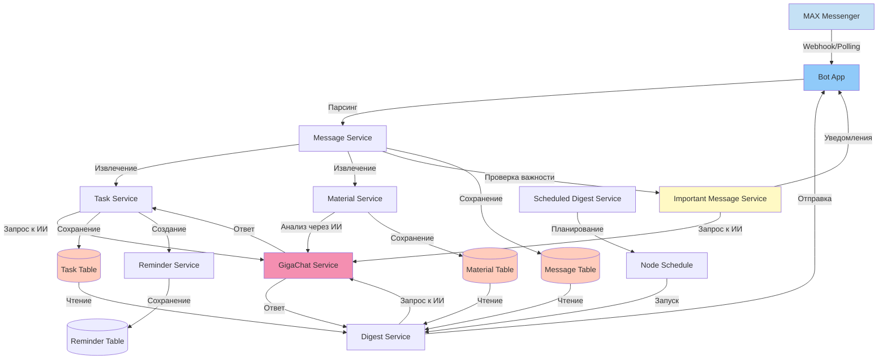

---

## 15. ОБРАБОТКА ОШИБОК И FALLBACK

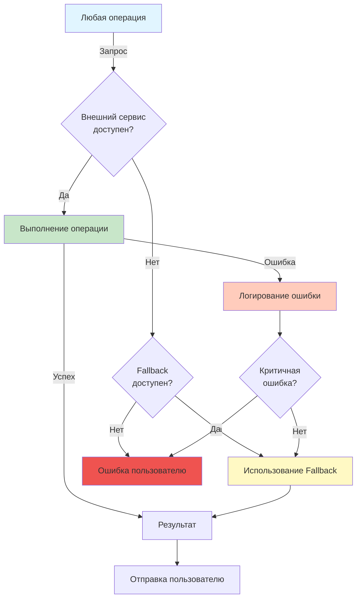

---

## 16. АВТОМАТИЧЕСКАЯ СИНХРОНИЗАЦИЯ ЧАТОВ

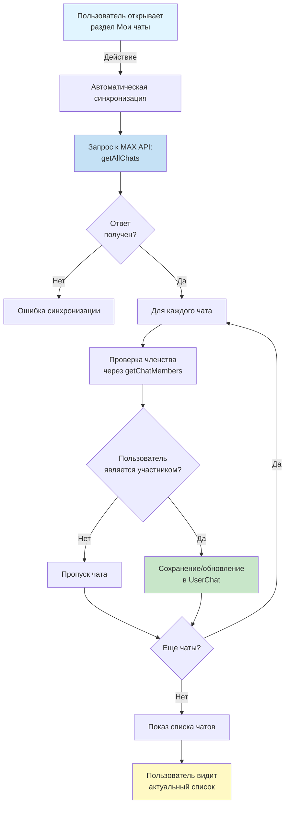

---

## 17. ИНТЕГРАЦИЯ С GIGACHAT

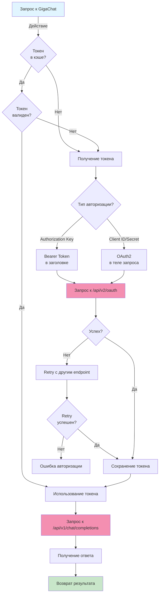

---

## 18. ОСНОВНЫЕ КОМАНДЫ И ИХ ПОТОКИ

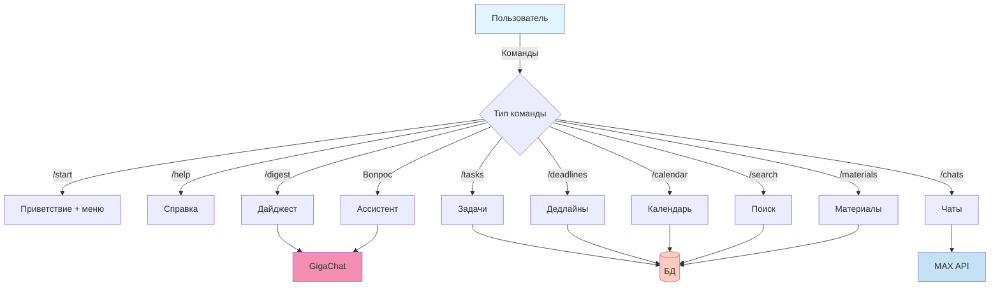

---

## 19. СЦЕНАРИЙ: ОПРЕДЕЛЕНИЕ ВАЖНЫХ СООБЩЕНИЙ

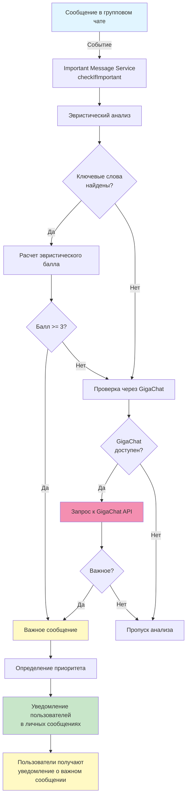

## 20. СЦЕНАРИЙ: ЗАПЛАНИРОВАННЫЕ ДАЙДЖЕСТЫ

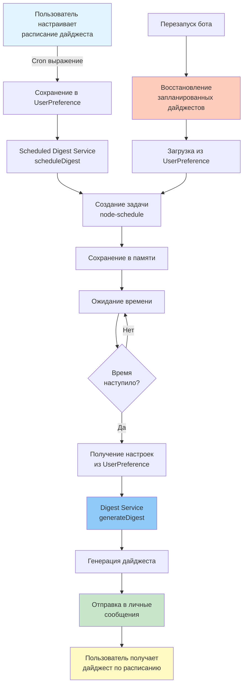

## 21. СЦЕНАРИЙ: ЭКСПОРТ В EXCEL

```mermaid
graph TD
    A[Пользователь:<br/>/calendar] -->|Команда| B{Формат<br/>экспорта?}
    
    B -->|Excel| C[Calendar Service<br/>exportToExcel]
    B -->|ICS| D[Calendar Service<br/>exportToICS]
    
    C --> E[Получение персональных задач]
    E --> F[Создание ExcelJS Workbook]
    F --> G[Настройка колонок:<br/>Дата, Время, Название, и т.д.]
    G --> H[Добавление данных]
    H --> I[Стилизация заголовков]
    I --> J[Генерация .xlsx файла]
    J --> K[Отправка файла]
    
    D --> L[Генерация ICS-файла]
    L --> K
    
    K --> M[Пользователь получает<br/>календарь в выбранном формате]
    
    style A fill:#e1f5ff
    style C fill:#ffccbc
    style J fill:#c8e6c9
    style M fill:#fff9c4
```

## 22. ТЕСТИРОВАНИЕ И КАЧЕСТВО

### Автоматическое тестирование

Проект включает **49 автоматических тестов** на Jest:

**Покрытие тестами:**
- ✅ Утилиты (text, date, number) - 42 теста
- ✅ Сервисы (taskService, digestService) - 7 тестов
- ✅ Все тесты проходят успешно
- ✅ Время выполнения: ~6-13 секунд

**Запуск тестов:**
```bash
npm test              # Все тесты
npm run test:watch    # Режим watch
npm run test:coverage # С отчетом о покрытии
```

**Структура тестов:**
- `src/utils/__tests__/text.test.ts` - тесты утилит для работы с текстом
- `src/utils/__tests__/date.test.ts` - тесты утилит для работы с датами
- `src/utils/__tests__/number.test.ts` - тесты утилит для работы с числами
- `src/services/__tests__/taskService.test.ts` - тесты сервиса задач
- `src/services/__tests__/digestService.test.ts` - тесты сервиса дайджестов

---

## ЗАКЛЮЧЕНИЕ

Все сценарии показывают полный цикл взаимодействия пользователя с ботом, включая:
- Обработку команд и сообщений
- Интеграцию с внешними сервисами (MAX API, GigaChat)
- Работу с базой данных
- Обработку ошибок и fallback-механизмы
- Автоматические процессы (напоминания, синхронизация, важные сообщения, запланированные дайджесты)
- Экспорт данных в различные форматы (ICS, Excel)
- Автоматическое тестирование для обеспечения качества кода

Схемы можно использовать для:
- Презентации архитектуры
- Документирования функциональности
- Понимания зависимостей между компонентами
- Отладки и анализа проблем
- Разработки и поддержки тестов

