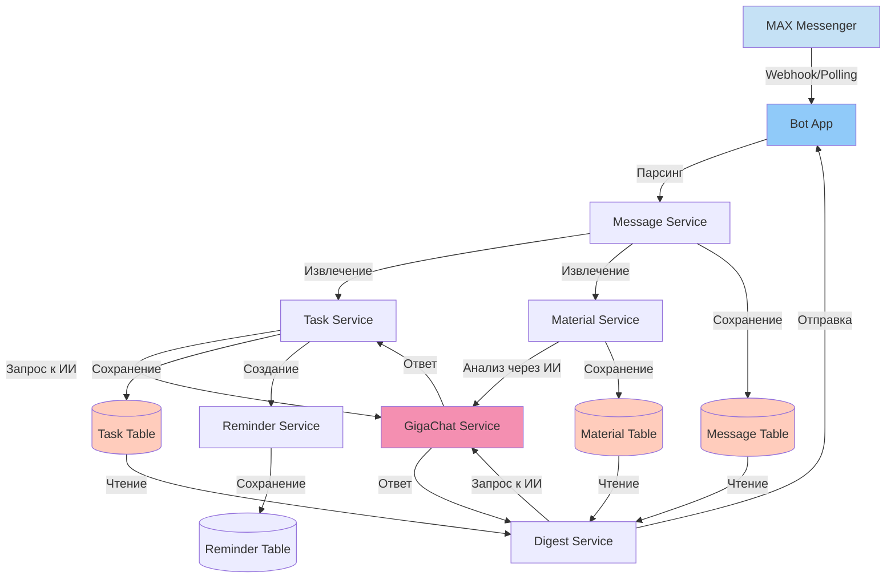

# ПОЛЬЗОВАТЕЛЬСКИЕ СЦЕНАРИИ И АРХИТЕКТУРА БОТА
## MAX Productivity Bot - Схемы взаимодействия

---

## 1. ОБЩАЯ АРХИТЕКТУРА СИСТЕМЫ

---

## 2. СЦЕНАРИЙ: ПЕРВОЕ ВЗАИМОДЕЙСТВИЕ С БОТОМ

---

## 3. СЦЕНАРИЙ: РАБОТА С ДАЙДЖЕСТАМИ

---

## 4. СЦЕНАРИЙ: АВТОМАТИЧЕСКОЕ ИЗВЛЕЧЕНИЕ ЗАДАЧ

---

## 5. СЦЕНАРИЙ: ПЕРСОНАЛЬНЫЙ АССИСТЕНТ

---

## 6. СЦЕНАРИЙ: УПРАВЛЕНИЕ ЧАТАМИ

---

## 7. СЦЕНАРИЙ: ПОИСК МАТЕРИАЛОВ И СООБЩЕНИЙ

---

## 8. СЦЕНАРИЙ: ЭКСПОРТ КАЛЕНДАРЯ

---

## 9. СЦЕНАРИЙ: АВТОМАТИЧЕСКИЕ НАПОМИНАНИЯ

---

## 10. СЦЕНАРИЙ: ОБРАБОТКА МАТЕРИАЛОВ

---

## 11. СЦЕНАРИЙ: ПРОСМОТР ДЕДЛАЙНОВ

---

## 12. СЦЕНАРИЙ: ПРОСМОТР МАТЕРИАЛОВ

---

## 13. ЗАВИСИМОСТИ МЕЖДУ СЕРВИСАМИ

---

## 14. ПОТОК ДАННЫХ: ОТ СООБЩЕНИЯ ДО ХРАНЕНИЯ

---

## 15. ОБРАБОТКА ОШИБОК И FALLBACK

---

## 16. АВТОМАТИЧЕСКАЯ СИНХРОНИЗАЦИЯ ЧАТОВ

---

## 17. ИНТЕГРАЦИЯ С GIGACHAT

---

## 18. ОСНОВНЫЕ КОМАНДЫ И ИХ ПОТОКИ

---

## ЗАКЛЮЧЕНИЕ

Все сценарии показывают полный цикл взаимодействия пользователя с ботом, включая:
- Обработку команд и сообщений
- Интеграцию с внешними сервисами (MAX API, GigaChat)
- Работу с базой данных
- Обработку ошибок и fallback-механизмы
- Автоматические процессы (напоминания, синхронизация)

Схемы можно использовать для:
- Презентации архитектуры
- Документирования функциональности
- Понимания зависимостей между компонентами
- Отладки и анализа проблем

